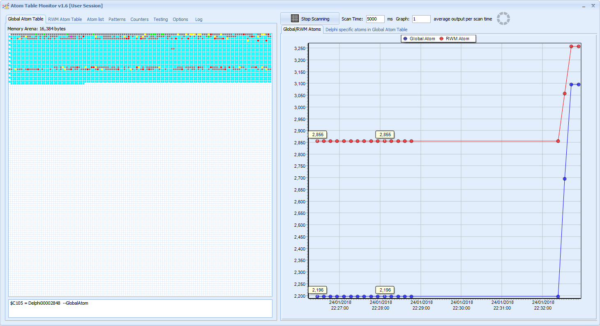
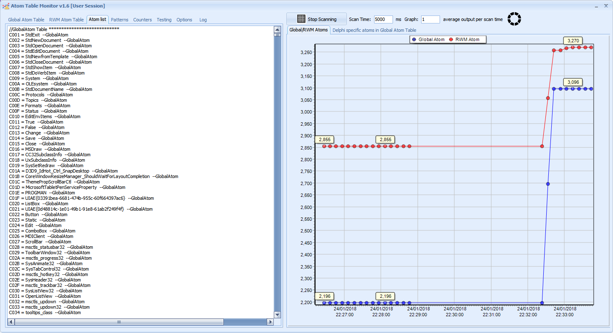
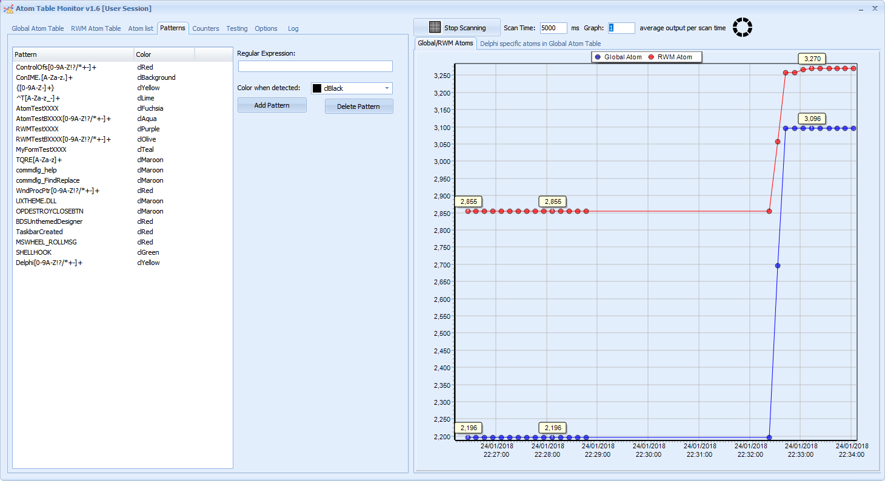
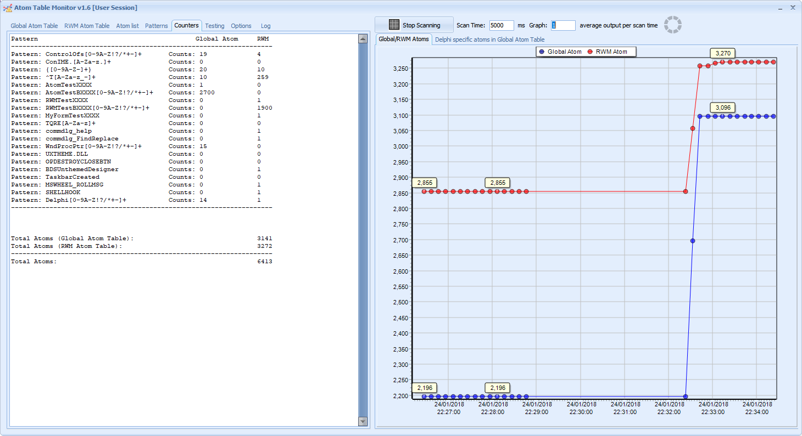
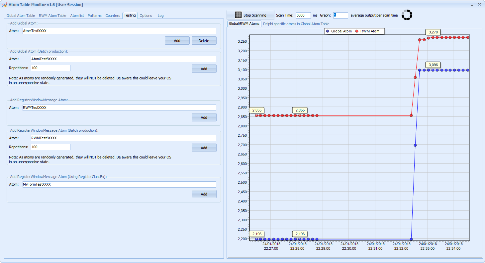
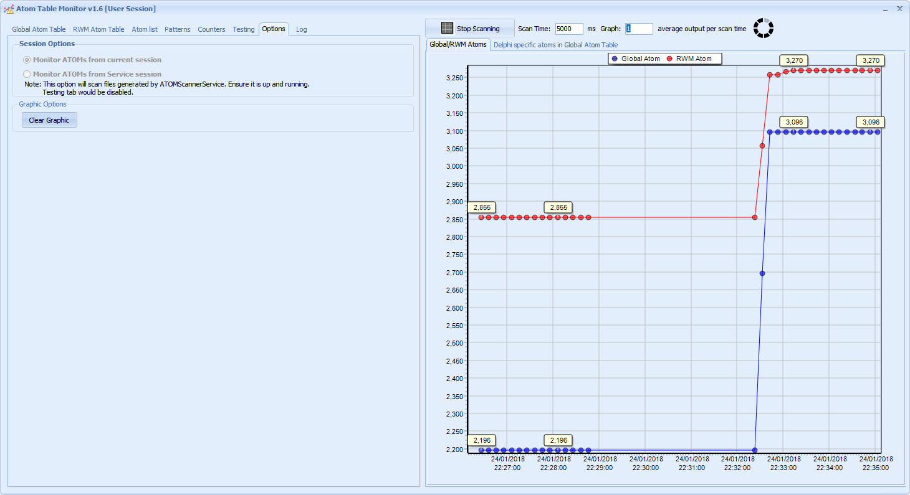

Monitoring tool for global atom table and RegisterWindowMessage identifiers.
==============
"An atom table is a system-defined table that stores strings and corresponding identifiers. An application places a string in an atom table and receives a 16-bit integer, called an atom, that can be used to access the string. A string that has been placed in an atom table is called an atom name"
--------------

**Source**: [Microsoft - About Atom tables](https://docs.microsoft.com/en-us/windows/win32/dataxchg/about-atom-tables)

With ATOM table Monitor, all created atoms using [RegisterClass](http://msdn.microsoft.com/en-us/library/windows/desktop/ms633586(v=vs.85).aspx), [RegisterClassEx](http://msdn.microsoft.com/en-us/library/windows/desktop/ms633587(v=vs.85).aspx), [GlobalAddAtom](http://msdn.microsoft.com/en-us/library/windows/desktop/ms649060(v=vs.85).aspx), [AddAtom](http://msdn.microsoft.com/en-us/library/windows/desktop/ms649056(v=vs.85).aspx) or identifiers from [RegisterWindowMessage](http://msdn.microsoft.com/en-us/library/windows/desktop/ms644947(v=vs.85).aspx) functions can be monitored and be sure our applications are not leaking Atoms / identifiers.

[](https://app.box.com/s/tbmze7klz6j3astnviygwrgkdi4fu7ft) [](https://app.box.com/s/tbmze7klz6j3astnviygwrgkdi4fu7ft) [](https://app.box.com/s/tbmze7klz6j3astnviygwrgkdi4fu7ft) [](https://app.box.com/s/tbmze7klz6j3astnviygwrgkdi4fu7ft)

**Related Articles:**
  - [Monitoring Global Atom table part I](http://thundaxsoftware.blogspot.com/2012/02/monitoring-global-atom-table-part-i.html)
  - [Monitoring Global Atom table part II](http://thundaxsoftware.blogspot.com/2012/02/monitoring-global-atom-table-part-ii.html)
  - [Monitoring Global Atom table part III](http://thundaxsoftware.blogspot.com/2012/02/monitoring-global-atom-table-part-iii.html)

**Features:**
  - Monitor Global atom entries from 0xC000 to 0xFFFF using [GlobalGetAtomName](http://msdn.microsoft.com/en-us/library/windows/desktop/ms649063(v=vs.85).aspx).
  - Monitor RegisterWindowMessage atom entries (identifiers) from 0xC000 to 0xFFF using [GetClipboardFormatName](http://msdn.microsoft.com/en-us/library/windows/desktop/ms649040(v=vs.85).aspx).
  - Memory displayed in a nice way using a memory grid.
  - Match pattern using regular expressions.
  - Graph displaying current values.
  - Testing table entries using GlobalAddAtom and RegisterWindowMessage functions.
  - Monitoring user session atoms and Service session atoms.
  - Windows 10 support.

**Notes:**
  - It uses **C:\** drive for internal use as it is hard-coded. (Be sure you have that drive in your system)

Version 1.6:

**Global atom table:**

**RegisterWindowMessage table:**

**Display list of entries:**

**Matching string patterns:**

**Counters:**

**Test screen:**

**Session screen selection:**

**Monitoring Service session atoms:**


**Scan Atoms method:**
```delphi
procedure ScanAtoms;
var
  i: word;
  cstrAtomName: array [0 .. 1024] of char;
  cstrRWMName: array [0 .. 1024] of char;
  AtomName, RWMName: string;
  len, lenRWM: integer;
  Value: string;
  countAtom, countRWM: integer;
begin
  countAtom := 0;
  countRWM := 0;
  for i := $C000 to $FFFF do
  begin
    Value := '';
    len := GlobalGetAtomName(i, cstrAtomName, 1024);
    lenRWM := GetClipboardFormatName(i, cstrRWMName, 1024);
    if len > 0 then
    begin
      AtomName := StrPas(cstrAtomName);
      SetLength(AtomName, len);
      Value := AtomName;
      Inc(countAtom);
      FATomTable[i - $C000].atom[0] := Value + '  --GlobalAtom';
    end;
    if lenRWM > 0 then
    begin
      RWMName := StrPas(cstrRWMName);
      SetLength(RWMName, lenRWM);
      Value := RWMName;
      Inc(countRWM);
      FATomTable[i - $C000].atom[1] := Value + '  --RWM';
    end;
  end;
end;
```

**Using regular expressions:**
```delphi
function GetColor(Text: string): TColor;
  var
    i: integer;
    perl: TPerlRegEx;
    res: TColor;
  begin
    res := clGray;
    for i := 0 to FListPatterns.count - 1 do
    begin
      perl := TPerlRegEx.Create;
      try
        perl.RegEx := UTF8String(FListPatterns[i].RegularEx);
        perl.Subject := UTF8String(Text);
        if perl.Match then
        begin
          res := FListPatterns[i].color;
          Break;
        end;
      finally
        perl.Free;
      end;
    end;
    result := res;
  end;
```

**Testing:**
```delphi
procedure AddatomClick(Sender: TObject);
var
  i: integer;
begin
  try
    GlobalAddAtom(PChar(getRandomString(Edit4.Text)));
    if GetLastError <> 0 then
    begin
      ShowMessage(IntToStr(GetLastError) + ' ' + SysErrorMessage(GetLastError));
      Break;
    end;
  Except
    on e: exception do
      ShowMessage(e.message + ' ' + IntToStr(GetLastError));
  end;
end;

procedure RWMAddAtom(Sender: TObject);
var
  i: integer;
  myString: string;
begin
  myString := getRandomString(Edit8.Text);
  try
    RegisterWindowMessage(PWideChar(myString));
    if GetLastError <> 0 then
    begin
      ShowMessage(IntToStr(GetLastError) + ' ' + SysErrorMessage(GetLastError));
      Break;
    end;
  Except
    on e: exception do
      ShowMessage(e.message + ' ' + IntToStr(GetLastError));
  end;
end;

function getRandomString(header: string): string;
const
  Chars = '1234567890ABCDEFGHJKLMNPQRSTUVWXYZ!?/*+-';
var
  S: string;
  i, N: integer;
begin
  Randomize;
  S := '';
  for i := 1 to 6 do
  begin
    N := Random(Length(Chars)) + 1;
    S := S + Chars[N];
  end;
  result := header + S;
end;
```

**Testing using RegisterClassEx**
```delphi
procedure btnCreateClick(Sender: TObject);
var
  WC: TWndclassEx;
  atom: word;
begin
  WC.lpszclassName := PWideChar(Edit10.Text);
  WC.cbSize := SizeOf(TWndclassEx);
  WC.style := CS_VREDRAW or CS_HREDRAW;
  WC.lpfnWndProc := @DefWindowProc;
  WC.cbClsExtra := 0;
  WC.cbWndExtra := 0;
  WC.hinstance := hinstance;
  WC.hIcon := Application.Icon.Handle;
  WC.hIconSm := Application.Icon.Handle;
  WC.hCursor := LoadCursor(0, IDC_ARROW);
  WC.lpszMenuName := nil;
  WC.hbrBackground := (COLOR_BACKGROUND + 1);

  atom := RegisterClassEx(WC);
  if atom <> 0 then
    ShowMessage('Atom Created at ' + IntToHex(atom, 4));
end;
```

**Tested under:**
  - Windows Xp, Vista, 7, Server 2003, Server 2008, Windows 10

**Developed under:**
  - Delphi 2010

**StackOverflow entry:**
  - [System Error. Code: 8. Not enough storage is available to process this command](http://stackoverflow.com/questions/507853/system-error-code-8-not-enough-storage-is-available-to-process-this-command/9066509#9066509)

**Microsoft Debug Blog entry:**
  - [Identifying global atom table leaks](https://docs.microsoft.com/en-us/archive/blogs/ntdebugging/identifying-global-atom-table-leaks).

## Sponsors
No sponsors yet! Will you be the first?

[](https://www.paypal.com/paypalme/jordicorbilla)
